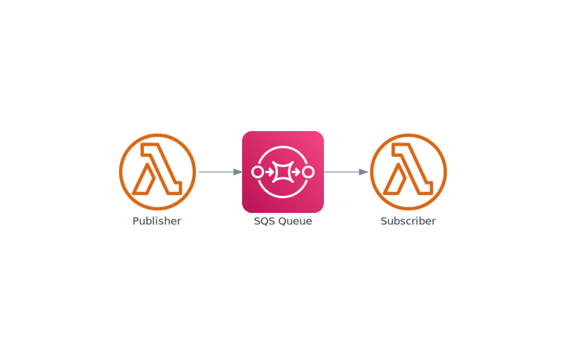

## Overview

A simple Pub-Sub setup 
Includes:
- AWS Lambda x2
- SQS



## Code
Write your publisher code in  [lambda_publisher](lambda_publisher/main.py)
Write your subscriber code in  [lambda_publisher](lambda_publisher/main.py)

## Provision the infrastructure with Terraform
```
cd terraform
terraform init
terraform apply
```

Tear down with:

```
terraform destroy
```